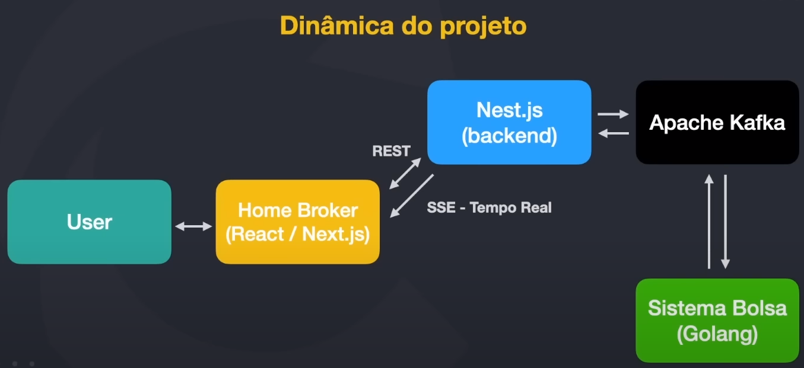
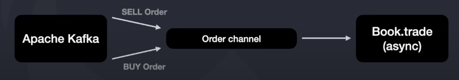
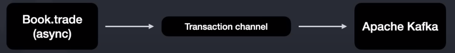

# Lecture 01 - Starting FullStack & Full Cycle Immersion

### 1 - Introdução

O propósito deste workshop é de construir uma plataforma de investimentos, com gráficos, dashboards e também um homebroker para poder simular em tempo real as ordens de compra e venda. 

As tecnologias que serão usadas neste projeto: Docker, Go, Kafka, Nest.js, Next.js, & Server Sent Events para lidar trabalhar com tempo real

### 2 - FullStack x Full Cycle,  Microsserviços 

<b>Desenvolvedor Fullstack:</b>

- Um desenvolvedor Fullstack é um profissional que tem habilidades de desenvolvimento em várias áreas, como front-end e back-end. Isso significa que eles são capazes de trabalhar em todas as camadas de uma aplicação, desde a interface do usuário até o banco de dados.
- Eles precisam ter um conhecimento sólido de várias linguagens de programação e frameworks, bem como entender como integrar diferentes componentes de uma aplicação.
No entanto, o foco principal de um desenvolvedor Fullstack é o desenvolvimento de software, e eles podem não ser responsáveis por outras partes do ciclo de vida do software, como implantação, monitoramento e manutenção.

<b>Desenvolvedor Full Cycle:</b>

- O termo "Desenvolvedor Full Cycle" foi cunhado pela Netflix em 2018 e se refere a desenvolvedores que são responsáveis por todo o ciclo de vida de um software, desde a concepção até a entrega, teste, implantação e monitoramento.
- Isso significa que eles não apenas desenvolvem o software, mas também são responsáveis por garantir que ele seja implantado corretamente e funcione como esperado em um ambiente de produção.
- Eles precisam ter um conhecimento profundo de várias ferramentas e tecnologias que permitem a implantação e o monitoramento eficientes de aplicações, além de serem capazes de escalar aplicações conforme necessário.
- Além disso, eles precisam entender os conceitos de arquitetura de software e ser capazes de projetar sistemas que sejam robustos, escaláveis e fáceis de manter.
- Arquitetar -> Desenvolver -> Testar -> Deployar -> Monitorar -> Suporte aos Microsserviços

Em resumo, a principal diferença entre um desenvolvedor Fullstack e um Full Cycle é o escopo de suas responsabilidades. Enquanto um desenvolvedor Fullstack se concentra principalmente no desenvolvimento de software, um desenvolvedor Full Cycle é responsável por todo o ciclo de vida do software, desde o desenvolvimento até a implantação e o monitoramento.

<b>Microserviços:</b>

- Microserviços são um tipo de arquitetura de software em que um sistema é dividido em pequenos sistemas especializados e independentes que, quando trabalham juntos, conseguem alcançar seu objetivo.
- Esta arquitetura é adotada por muitas grandes empresas atualmente.
Trabalhar com sistemas baseados em microserviços exige que os desenvolvedores se adaptem ao ritmo da "orquestra" e façam sua parte muito bem.

### 3 - Dinâmica do Projeto

#### 3.1 - Ordem de Desenvolvimento

- Dia 01: Criação do microsserviço de bolsa com seu principal algoritimo funcionando
- Dia 02: Adoção do Apache Kafka ao microsserviço de bolsa para enviar e receber as ordens
- Dia 03: Desenvolvimento do Backend (Nest.js) do Home Broker
- Dia 04: Desenvolvimento do Frontend (Next.js) do Home Broker
- Dia 05: Integração do Frontend e Backend e ajustes finos

### 4 - Microsserviço
#### 4.1 - Microsserviço de "Bolsa"

- Cada vez que uma ordem de copra e venda dão "match", será gerada uma transação
- Essa transação será publicada no Apache Kafka no formato JSON
- Não será utilizado BD por conta de tempo e simplificação (5 dias de workshop)
- Se o processo morrer, será perdido todas as transações (por motivo de simplificação de projeto)

#### 4.2 -  Microsserviço de "Bolsa" - Channels 
- Linguagem Go trabalha com "channels" para fazer comunicação entre threads
- Todas as ordens de compra e venda serão enviadas a um único channel para poderem ser registradas no "livro" de compra/venda 

- Quando um "match" ocorre, uma "transaction" é gerada e enviada a um channel de output que será lido pelo Apache Kafka

