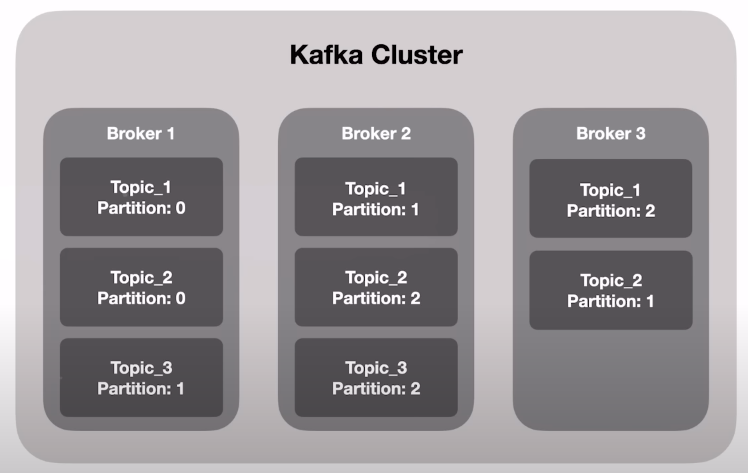

# _[Lecture 02 - Communication between microservices with Apache Kafka](https://www.youtube.com/watch?v=RRo0Vdydbyk)_

### 1 - Introdução

O Apache Kafka é uma plataforma de streaming de dados em tempo real utilizada por grandes empresas como Uber, Netflix, LinkedIn e Spotify. Sua utilidade se destaca em sistemas distribuídos e transações assíncronas, garantindo que os dados não sejam perdidos, mesmo que vários micro serviços fiquem indisponíveis. Além disso, permite que cada sistema consuma essas transações no seu próprio ritmo, de acordo com suas próprias métricas de qualidade.

O Kafka vai além de ser apenas um sistema de filas, pois tem a capacidade de armazenar dados em disco, permitindo que os sistemas reprocessem as informações, se necessário. Sua resiliência e distribuição permitem que ele lide com uma grande quantidade de dados sem perder informações.

No Kafka, os tópicos são fluxos de dados que atuam como um banco de dados. Cada tópico tem várias partições, cada uma definida por um número. As mensagens são enviadas para diferentes partições, o que ajuda a garantir a resiliência do sistema.

Existem dois componentes principais no Kafka: produtores e consumidores. Os produtores são os sistemas que enviam mensagens para o Kafka, enquanto os consumidores são os sistemas que leem essas mensagens. Vários consumidores podem ler o mesmo tópico ao mesmo tempo, o que é útil para sistemas que precisam processar a mesma informação de maneiras diferentes.

### 2 - Caracteristicas

  - <b>Utilidade em Sistemas Distribuídos e Transações Assíncronas:</b> O Kafka garante que os dados não sejam perdidos, mesmo que vários micro serviços fiquem indisponíveis. Além disso, permite que cada sistema consuma essas transações no seu próprio ritmo, de acordo com suas próprias métricas de qualidade.

  - <b>Event-Driven:</b> O Kafka é uma plataforma que permite o processamento de eventos em tempo real. Isso é especialmente útil em sistemas distribuídos onde várias transações ocorrem simultaneamente.

  - <b>Armazenamento de Dados em Disco:</b> O Kafka armazena dados em disco, o que permite que os sistemas reprocessem informações quando necessário. Isso é diferente de muitos sistemas de mensagens que armazenam dados apenas na memória.

  - <b>Resiliência e Distribuição:</b> O Kafka é projetado para ser resiliente e distribuído. Isso significa que ele pode lidar com uma grande quantidade de dados sem perder informações, mesmo se alguns sistemas falharem.

  - <b>Tópicos e Partições:</b> O Kafka usa o conceito de tópicos e partições. Um tópico é um fluxo de dados, e cada tópico pode ter várias partições. As mensagens são enviadas para diferentes partições, o que ajuda a garantir a resiliência do sistema.

  - <b>Produtores e Consumidores:</b> No Kafka, os produtores são os sistemas que enviam mensagens, e os consumidores são os sistemas que lêem essas mensagens. Vários consumidores podem ler o mesmo tópico ao mesmo tempo, o que é útil para sistemas que precisam processar a mesma informação de maneiras diferentes.

  - <b>Cluster Kafka:</b> O Kafka é um cluster, um conjunto de brokers. Cada broker é uma máquina onde o Kafka está instalado e é responsável por armazenar dados de uma partição. Cada partição de um tópico está distribuída entre vários brokers, o que contribui para a resiliência e a distribuição do Kafka.

  - <b>Baixa Latência:</b> O Kafka tem uma latência muito baixa, o que significa que ele pode processar e transmitir mensagens muito rapidamente. Isso é essencial para sistemas que precisam processar grandes volumes de dados em tempo real.

  - <b>Persistência de Dados:</b> Ao contrário de alguns sistemas de mensagens, o Kafka mantém os dados mesmo depois de serem consumidos. Isso permite que os sistemas reprocessem as informações se necessário.

### 3 - Tópicos no Apache Kafka

Um tópico é um fluxo de dados que atua como um banco de dados. Cada tópico possui diversas partições, e cada partição é definida por um número.

Quando uma mensagem é enviada para um tópico no Kafka, essa mensagem é armazenada em uma das partições desse tópico. Isso é feito para garantir a resiliência do sistema, pois mesmo que uma partição falhe, as outras partições ainda estarão disponíveis para processar as mensagens.

Além disso, o Kafka permite que várias mensagens sejam enviadas para diferentes partições ao mesmo tempo. Isso é útil para sistemas que precisam processar grandes volumes de dados em tempo real, pois permite que as mensagens sejam processadas de maneira mais eficiente.

Um exemplo prático seria um e-commerce que utiliza o Kafka para processar transações de compra. Quando um cliente faz uma compra, essa transação é enviada como uma mensagem para um tópico no Kafka. A mensagem então é armazenada em uma das partições desse tópico. Se o sistema de processamento de pagamentos estiver temporariamente indisponível, a mensagem ainda estará segura no Kafka e poderá ser processada quando o sistema voltar a funcionar.

Além disso, o Kafka permite que vários sistemas consumam as mensagens do mesmo tópico ao mesmo tempo. Por exemplo, quando uma transação de compra é enviada para um tópico, tanto o sistema de processamento de pagamentos quanto o sistema de inventário podem consumir essa mensagem e processá-la de acordo com suas necessidades específicas.

### 4 - Kafka Cluster

O Kafka Cluster consiste em um conjunto de brokers, cada um sendo uma máquina (servidor) com o Kafka instalado. Cada broker armazena dados de uma partição específica.

Um exemplo ilustrativo envolve três máquinas, ou brokers, no Kafka. Quando se cria um tópico com três partições, cada partição é armazenada em um broker diferente. Assim, os dados do tópico ficam distribuídos entre os três brokers.

Essa distribuição de dados entre vários brokers aumenta a resiliência e a distribuição do Kafka. Se um broker falhar, os dados ainda estarão seguros nos outros brokers. Além disso, a distribuição dos dados permite que o Kafka processe grandes volumes de dados de maneira eficiente.

Portanto, um Kafka Cluster é uma configuração que envolve várias máquinas trabalhando juntas para armazenar e processar dados. Cada máquina, ou broker, no cluster armazena uma parte dos dados, contribuindo para a resiliência e a eficiência do sistema.

#### 4.1 - Kafka: Replication Factor

O "replication factor" no Kafka é um conceito importante para a resiliência e a distribuição de dados. Ele se refere ao número de cópias de uma partição que são mantidas no cluster Kafka.

Por exemplo, se o fator de replicação for definido como 3, cada partição de um tópico será replicada em três brokers diferentes. Isso significa que, mesmo que um broker falhe, ainda haverá duas cópias dos dados disponíveis em outros brokers.

Essa estratégia de replicação aumenta a resiliência do sistema, pois garante que os dados não sejam perdidos se um broker falhar. Além disso, a replicação de dados entre vários brokers permite que o Kafka processe grandes volumes de dados de maneira eficiente.

Portanto, o fator de replicação é uma configuração crucial no Kafka que ajuda a garantir a resiliência e a eficiência do sistema.

#### 4.2 Kafka: Consumer Groups

Os Consumer Groups são essenciais para o funcionamento do Kafka, pois permitem que várias instâncias de consumidores leiam de um tópico simultaneamente.

Cada consumidor dentro de um grupo de consumidores lê de uma partição exclusiva de um tópico, garantindo que cada mensagem seja consumida por exatamente um consumidor dentro do grupo. Se você tiver mais consumidores do que partições em um tópico, alguns consumidores ficarão ociosos, pois eles não terão nenhuma partição para ler. Por outro lado, se houver mais partições do que consumidores, os consumidores poderão ler de várias partições.

Por exemplo, se você tiver um tópico com três partições e um grupo de consumidores com três consumidores, cada consumidor lerá de uma partição. Se um consumidor falhar, o Kafka reatribuirá a partição à qual o consumidor estava lendo para outro consumidor no grupo. Isso permite que o Kafka seja resiliente a falhas e continue a processar mensagens mesmo quando alguns consumidores falham.

Além disso, os grupos de consumidores permitem que o Kafka forneça "entrega garantida", pois o Kafka mantém o controle de qual mensagem foi lida por qual consumidor em um grupo de consumidores. Isso é feito mantendo um "offset", que é um tipo de marcador que aponta para a próxima mensagem a ser lida em uma partição. Quando um consumidor lê uma mensagem, ele também envia um reconhecimento ao Kafka, que atualiza o offset.

Portanto, os grupos de consumidores no Kafka permitem que várias instâncias de consumidores leiam de um tópico simultaneamente, garantindo que cada mensagem seja lida por exatamente um consumidor e permitindo que o Kafka seja resiliente a falhas.

#### 4.3 Kafka: Ecossistema 

- <b> Kafka Connect:</b> É uma ferramenta para importar e exportar dados de e para o Kafka de várias fontes e destinos, como bancos de dados, sistemas de arquivos, serviços de mensagens, etc. Ele permite que os desenvolvedores criem, configurem e gerenciem conectores que movem dados entre o Kafka e outros sistemas. Por exemplo, você pode ter um conector que lê dados de um banco de dados MySQL e os publica em um tópico do Kafka, ou um conector que lê mensagens de um tópico do Kafka e as grava em um arquivo CSV.

- <b> Kafka Streams:</b> É uma biblioteca cliente para processamento e análise de dados armazenados no Kafka. Ele fornece uma maneira de construir aplicações e microsserviços onde os dados de entrada e saída são armazenados em tópicos do Kafka. Por exemplo, você pode criar uma aplicação que lê mensagens de um tópico do Kafka, realiza algum processamento nos dados (como filtragem, agregação, junção, etc.) e publica os resultados em outro tópico do Kafka.

- <b> KSQL:</b> É uma interface de linguagem SQL para processamento de fluxo no Kafka. Ele permite que os usuários criem, executem e testem consultas SQL em dados em tempo real no Kafka. Por exemplo, você pode usar o KSQL para criar um fluxo que seleciona mensagens de um tópico do Kafka onde o valor de um campo específico é maior que um certo valor.

- <b> Schema Registry:</b> É um serviço que fornece uma maneira de armazenar e recuperar versões de esquemas de dados do Avro, que são usados para garantir que os dados sejam consistentemente compatíveis. Por exemplo, se você estiver usando o Avro para serializar suas mensagens do Kafka, você pode usar o Schema Registry para armazenar o esquema Avro para suas mensagens. Isso permite que os produtores e consumidores verifiquem se suas mensagens estão em conformidade com o esquema.

- <b> Rest Proxy:</b> Fornece uma interface RESTful para produzir e consumir mensagens do Kafka, bem como para realizar operações administrativas. Ele é útil para integração com tecnologias que não possuem um cliente Kafka oficial. Por exemplo, você pode usar o Rest Proxy para produzir e consumir mensagens do Kafka a partir de uma aplicação escrita em uma linguagem que não tem uma biblioteca cliente Kafka oficialmente suportada.

{
  "order_id": "1",
  "investor_id": "Mari",
  "asset_id": "asset1",
  "current_shared": 10,
  "shares": 5,
  "price": 5.0,
  "order_type": "SELL"
}

{
  "investor_id": "Celia",
  "asset_id": "asset1",
  "current_shared": 0,
  "shares": 5,
  "price": 5.0,
  "order_type": "BUY"
}